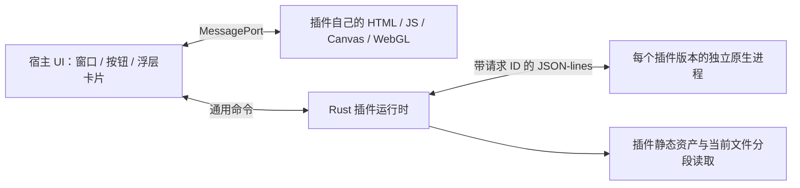

# 架构与边界

## 宿主负责什么

- 按扩展名收集所有匹配插件；省略、`all`、`*` 匹配所有文件。分配视口、浮层和功能气泡，不再按 ID 独占格式。按不透明的数据契约选择一个解析源，消费者共享源数据与 RPC，详见 [能力协议](specs/plugin-capabilities.md)。
- Rust 原生托盘与 Explorer 空格监听常驻；预览与设置各自使用按需创建的独立窗口。
- 提供视图区域、主题颜色、统一的工具栏控件样式与浮层卡片（位置、拖动、置顶），以及文件选择和通用窗口交互。**视口尺寸由宿主决定**：普通模式是标题栏与功能栏之间的那一段，沉浸模式是整个窗口，插件不切换也不感知这个开关，详见 [插件开发](plugins.md) 的视口一节。宿主不认识搜索、图层这类功能，也不提供对应组件。
- 原样转发插件业务 JSON，不识别 text/image/model 等渲染类型，不解释文档树。
- 提供当前会话文件的有限分段读取与插件包内静态资产访问。
- 管理原生子进程、并发 RPC、会话选择、超时、安装和回收。

## 插件负责什么

- 自带原生可执行程序及它需要的解析库，完成格式识别、解码和数据处理。
- 自带整个网页视图与资源，决定 DOM、Canvas、WebGL 或其他 WebView2 支持的画法。
- 自己声明工具栏按钮，自己处理点击、搜索和所有内容交互；需要功能操作区就打开自己的浮层并在里面画，宿主不认识这些功能。
- 自己处理文件大小、分页、解码精度和错误。宿主不会因为添加新格式而新增分支。

`sdk` 只提供传输便利函数，插件也可以不用 SDK，直接实现协议。Rust SDK 不是宿主渲染库。文本和图片插件都不链接宿主代码。

## 生命周期

1. 扫描清单只读取元数据，不启动插件。
2. 打开文件创建会话并返回 ID，Rust 自有任务负责加载。每个包版本按需创建一个独立进程。
3. 同一进程的请求按 ID 多路复用。示例插件 SDK 使用四个工作线程，慢解析不会阻塞下一个请求。
4. 选择另一会话只修改 active ID。已发出的加载不取消，旧结果只更新旧会话。
5. 原生解析完成后加载插件 iframe，插件完成首次视图初始化后调用 `presented()`。这一阶段也不因类型切换回收。非当前 iframe 隐藏并收到 `visible:false`；插件应停止不必要的动画。
6. 当前文件的所有插件贡献保持存活；其他文件在所有贡献闲置 120 秒后回收。有未完成原生调用或未保存编辑时，整个文件组和解析源均不回收。
7. 隐藏预览时解除 active 引用，已发出的原生调用继续完成。没有未保存草稿时，预览和设置窗口各自在隐藏满 120 秒后销毁，托盘进程不退出；下次触发重建 WebView。设置窗口从不创建插件 iframe。
8. 同一插件的最后一个会话被回收后终止其进程。托盘“退出”才关闭应用并终止全部插件进程。

文件缓存键包含规范路径、大小、修改时间和整组匹配插件的不可变版本目录。切换视口不改变 fileId。上限 16 个文件、每文件 32 个插件、全局 64 个插件实例；RPC 限制 8 MiB/条、120 秒超时，每会话最多 8 个并发业务调用。统计快照不包含文档正文。

插件更新采用不可变版本目录。新版本不会覆盖 Windows 已加载的 EXE/DLL，不会中断旧加载。卸载从注册表立即移除，当前会话完成并闲置后删除包文件。

## 隔离与限制

解析代码运行在独立原生进程；这不是 OS 权限沙箱，安装的本机程序与用户拥有相同权限。原型仅适合可信插件：目录有哈希校验，但**没有签名校验**（见上文“插件市场”），因此插件源与手动安装程序同级，只适合用户自己决定信任的来源。

视图使用不带 `allow-same-origin` 的 sandbox iframe，通过父窗口转移的专用 MessagePort 通信。插件页面无 Tauri API；宿主验证消息、控件数量、路径边界和读取范围。资源协议拒绝跨目录路径和符号链接逃逸，页面 CSP 禁止网络与任意外部脚本。原生程序本身不受页面 CSP 限制。

iframe 不保证每插件一个独立 WebView 渲染进程。重型 JS 解析应放到插件原生进程或插件 Web Worker，隐藏时暂停渲染循环。当前通用文件通道使用最多 1 MiB 的 Base64 分块，适合最小原型，不宣称达到大型 FBX/PSD 的零拷贝吞吐量。

## 开发更新

- 宿主前端：Vite HMR。
- 宿主 Rust：标准 Tauri CLI 监视 workspace 后重编译、重启。重启时会话不保留。
- 插件：统一开发命令已包含监视，发布市场新版本后自动更新已经安装的市场插件；新打开文件使用新版本，旧会话继续完成。插件源码与市场目录从 Tauri watcher 排除，避免连带重启宿主。

## 插件市场

宿主是外壳：没有任何预览实现，也不打包任何插件，发行包里只有应用本体和一份插件源配置（`plugin-sources.json`）。结构分三层，职责不重叠：宿主负责解析来源、校验、安装与运行；**插件源**是一份远程目录，负责插件信息；目录条目里的 artifact 链接负责包下载。

`.marketplace/catalog.json` 是开发环境的本地镜像（`plugins:build` 的产物），线上则是一份上传出去的 `catalog.json`。目录以插件 id、版本与内容指纹命名包，发布目录完成后原子替换索引。读取校验 API 版本、条目数、ID 重复、路径边界，以及每个条目是否自洽（artifact 名、`sha256` 形状、`buildId`）。

下载、校验与解包全部发生在准备阶段，因此安装器只复制一棵已经验证过的目录树；解包到缓存以 artifact 的 `sha256` 命名，重复安装不重复下载。解包器只接受固定形态的包：条目名必须是普通相对路径，符号链接、加密条目、声明或实际超出体积上限的内容全部拒绝，并且这些检查都发生在写入任何文件之前。

目录的读取结果按 10 分钟缓存（界面轮询 `market_list`，不能每次请求都走网络）；读取失败的来源沿用上一次成功的结果并在界面列为警告，而不是让市场静默地少掉插件。同一个插件的多个镜像合并成一张卡片、多个 URL，安装按顺序回退。

校验回答两个不同的问题：`sha256` 证明拿到的字节就是目录索引的文件，`buildId` 证明解包后的内容声明的构建与目录索引一致。两者都不能替代签名——`buildId` 由打包脚本从内容算出，宿主无法重算它，且目录本身若可被替换则整套校验失去意义。目录的 `signature` 字段已经预留：当前版本不实现校验，因此**声明签名的目录会被拒绝**，以免把未校验的目录呈现为已校验。

首次启动会打开一次引导页，让用户从插件源里勾选要安装的插件。它不改变安装本身：勾选项走的是同一条 `market_prepare` → `install_plugin` 路径，宿主也不会因为"这是首次启动"而使用任何特权路径。答案记在 `host-state.json`，所以只出现一次。

安装、卸载与开发更新串行执行，开发更新再次检查插件仍处于已安装状态，避免与卸载竞争导致重新安装。发行版只在用户点击时安装/更新；开发版自动同步已安装的市场插件（开发环境把最近一次构建当作本地镜像，且不读官方源）。发布流程、包格式与来源配置见[插件开发](plugins.md)。

这区分了“切换类型不中断加载”与“修改宿主 Rust 后进程重启”，后者不能承诺保留内存任务。

官方开发行为：[Tauri Develop](https://v2.tauri.app/develop/)、[Vite 配置](https://v2.tauri.app/start/frontend/vite/)。

桌面生命周期、原生选择线程和多标签页匹配细节见 [Windows 桌面开发说明](windows-desktop.md)。

