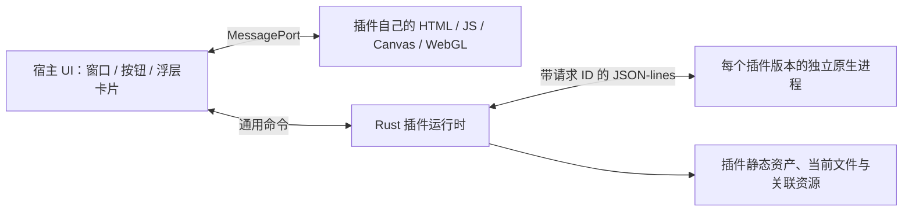

# 架构与边界

## 宿主负责什么

- 按扩展名收集所有匹配插件；省略、`all`、`*` 匹配所有文件。为匹配的每个插件分配视口、浮层和功能气泡，没有插件能按 ID 独占一个格式。按不透明的数据契约选择一个解析源，消费者共享源数据与 RPC，详见 [能力协议](specs/plugin-capabilities.md)。
- Rust 原生托盘与 Explorer 空格监听常驻；预览与设置各自使用按需创建的独立窗口。
- 提供视图区域、主题颜色、少量通用工具栏入口、浮层与模态容器，以及文件选择和通用窗口交互。**视口尺寸由宿主决定**：普通模式是标题栏与功能栏之间的那一段，沉浸模式是整个窗口，插件不切换也不感知这个开关，详见 [插件开发](plugins.md) 的视口一节。**层级也由宿主决定**：两条栏、四角感应区与插件浮层永远画在插件渲染内容之上，插件不得盖住它们；契约与插件侧的义务见 [插件开发](plugins.md) 的浮层置顶一节。宿主提供的界面原语不携带文件格式或业务功能语义。
- 原样转发插件业务 JSON，不识别 text/image/model 等渲染类型，不解释文档树。
- 提供当前会话文件的有限分段读取、面向 Range 消费者的通用有界流式 URL、插件包内静态资产访问，以及经独立权限授权的文档关联资源通道；插件负责选择读取策略并解释内容，宿主只处理权限、寻址与字节传输。
- 持有界面语言的最终取值（托盘、原生对话框、窗口标题、报错），并把语言标签转发给每个插件网页；插件界面的文案由插件自己翻译，宿主不认识它们的内容。
- 管理原生子进程、并发 RPC、会话选择、超时、安装和回收。

## 插件负责什么

- 自带原生可执行程序及它需要的解析库，完成格式识别、解码和数据处理。
- 自带整个网页视图与资源，决定 DOM、Canvas、WebGL 或其他 WebView2 支持的画法。
- 自己声明工具栏按钮，自己处理点击、搜索和所有内容交互；需要功能操作区就打开自己的浮层并在里面画，宿主不认识这些功能。
- 可复用的视觉规则放在插件侧 SDK；宿主只承载通用界面容器、管理焦点并传递不透明结果，不解释插件状态或事件。业务能力应能随插件包独立升级；只有跨格式成立、载荷与结果都保持语义无关的原语才进入宿主协议。
- 预览贡献以快速、只读地看见内容为目标。为兼容显示而产生的中间数据必须是会话级临时实现，不得暴露为持久转换结果；编辑、转换或覆盖源文件属于独立贡献和独立权限边界。
- 自己处理文件大小、分页、解码精度和错误。宿主不会因为添加新格式而新增分支。

`sdk` 只提供传输便利函数，插件也可以不用 SDK，直接实现协议。Rust SDK 不是宿主渲染库。文本和图片插件都不链接宿主代码。

## 界面语言

语言由窗口解析、宿主执行、插件自己翻译。

窗口是唯一能看到系统偏好的地方，它把结果推给宿主；宿主把它存进 `host-state.json`，于是托盘菜单、原生对话框、窗口标题和所有返回给界面的报错都跟着变，下一次启动在任何窗口出现之前就已经是这门语言。语言的解析和存储分开：窗口拥有"跟随系统还是指定语言"这个选择（和主题一样在本地设置里），宿主只记住最终生效的那个标签。

宿主自己的文案是两份 catalog，各自覆盖一层：前端界面在 `src/i18n/`（以英文为准定义全部 key，中文缺一个 key 就编译不过），原生侧在 `crates/runtime/src/i18n.rs`（`text!` 把两种语言并排声明，并由测试保证两边都不为空、不是同一句、占位符一致）。`Package::load` 那类"包自己写坏了"的诊断信息保持英文：它们是给插件作者的，像编译器报错，不是界面文案。

插件画的界面文案不经过宿主，见[插件开发](plugins.md)：宿主只转发语言标签，插件用它自己的字典（`translate()`）取值。声明在清单里的插件文案（名称、设置项说明）由宿主绘制，因此由宿主的取值逻辑解析。

## 生命周期

1. 扫描清单只读取元数据，不启动插件。
2. 打开文件创建会话并返回 ID，Rust 自有任务负责加载。每个包版本按需创建一个独立进程。
3. 同一进程的请求按 ID 多路复用。示例插件 SDK 使用四个工作线程，慢解析不会阻塞下一个请求。
4. 选择另一会话只修改 active ID。已发出的加载不取消，旧结果只更新旧会话。
5. 原生解析完成后加载插件 iframe，插件完成首次视图初始化后调用 `presented()`。这一阶段也不因类型切换回收。非当前 iframe 隐藏并收到 `visible:false`；插件应停止不必要的动画。
6. 当前文件的所有插件贡献保持存活；其他文件在所有贡献闲置 120 秒后回收。有未完成原生调用或插件声明了未提交变更时，整个文件组和解析源均不回收。
7. 隐藏预览时解除 active 引用，已发出的原生调用继续完成。没有未提交变更时，预览和设置窗口各自在隐藏满 120 秒后销毁，托盘进程不退出；下次触发重建 WebView。设置窗口从不创建插件 iframe。
8. 同一插件的最后一个会话被回收后终止其进程。托盘“退出”才关闭应用并终止全部插件进程。

文件缓存键包含规范路径、大小、修改时间和整组匹配插件的安装目录。切换视口不改变 fileId；覆盖更新在换掉目录内容之前会先丢掉该插件的会话，所以不会命中换包前的缓存。上限 16 个文件、每文件 32 个插件、全局 64 个插件实例；RPC 限制 8 MiB/条、120 秒超时，每会话最多 8 个并发业务调用。统计快照不包含文档正文。

安装、卸载与插件更新串行执行。**更新是覆盖式的，每个插件在磁盘上只有一个目录**：宿主先停掉该插件的原生进程（Windows 上目录里有正在运行的 exe 就既改不了名也删不掉），把新包换进同一个安装目录，再按原路径重开被切断的预览。换装用两次目录改名完成，中途崩溃由下次扫描回滚成“仍是旧版本”，不会留下新旧混装；`scan` 只认一个修订，发现同一插件的多余目录会按卸载同一条路径退休。插件通过 `pending()` 声明未提交变更时，更新、停用、卸载与重置都会被拒绝，并引用插件给出的措辞。卸载从注册表立即移除，包目录按修订退休，等当前会话结束且闲置后由回收删除；下载缓存同时丢掉该插件不再在用的包。

## 隔离与限制

解析代码运行在独立原生进程；这不是 OS 权限沙箱，安装的本机程序与用户拥有相同权限。0.1.0 基线只适合可信插件：目录有哈希校验，但**没有签名校验**（见上文“插件市场”），因此插件源与手动安装程序同级，只适合用户自己决定信任的来源。

视图使用不带 `allow-same-origin` 的 sandbox iframe，通过父窗口转移的专用 MessagePort 通信。插件页面无 Tauri API；宿主验证消息、控件数量、路径边界和读取范围。插件包静态资源不能逃出包目录；声明 `readResources` 的插件可以按文档原始引用读取相对、绝对或 `file:` 本地资源，并由宿主代取公开 HTTP(S) 资源。动态网络逐跳校验重定向、解析并固定公网 DNS 地址，拒绝本机、内网与链路本地地址。页面 CSP 仍禁止直接联网和任意外部脚本。原生程序本身不受页面 CSP 限制。

iframe 不保证每插件一个独立 WebView 渲染进程。重型 JS 解析应放到插件原生进程或插件 Web Worker，隐藏时暂停渲染循环。通用 RPC 分段读取每次最多 1 MiB；支持 Range 的原生消费者可通过有界流式 URL 按需取段，整文件 Blob 和关联资源仍会占用 WebView 内存。流式 URL 是格式无关的传输原语，不能成为把解码、时间轴或其它业务语义放进宿主的理由。

## 开发更新

- 宿主前端：Vite HMR。
- 宿主 Rust：标准 Tauri CLI 监视 workspace 后重编译、重启。重启时会话不保留——这是整进程重启，区别于“切换类型不中断加载”。
- 插件：统一开发命令已包含监视，构建出新的 `buildId` 后开发宿主覆盖安装已装的插件，被切断的预览自动重开，不需要手动关掉再打开文件。本地镜像缓存 1 秒，宿主每 2 秒检查一次；未保存内容会阻止更新。插件源码与市场目录从 Tauri watcher 排除，避免连带重启宿主。

## 插件市场

宿主是外壳：没有任何预览实现，也不打包任何插件，发行包里只有应用本体和一份插件源配置（`plugin-sources.json`）。结构分三层，职责不重叠：宿主负责解析来源、校验、安装与运行；**插件源**是一份远程目录，负责插件信息；目录条目里的 artifact 链接负责包下载。

`.marketplace/catalog.json` 是开发环境的本地镜像（`plugins:build` 的产物），线上则是一份上传出去的 `catalog.json`。目录以插件 id、版本与内容指纹命名包，发布目录完成后原子替换索引。读取校验 API 版本、条目数、ID 重复、路径边界，以及每个条目是否自洽（artifact 名、`sha256` 形状、`buildId`）。

下载、校验与解包全部发生在准备阶段，因此安装器只复制一棵已经验证过的目录树；解包到缓存以 artifact 的 `sha256` 命名，重复安装不重复下载。解包器只接受固定形态的包：条目名必须是普通相对路径，符号链接、加密条目、声明或实际超出体积上限的内容全部拒绝，并且这些检查都发生在写入任何文件之前。

远程目录读取结果缓存 10 分钟，本地镜像缓存 1 秒，用户可手动刷新（界面轮询 `market_list`，不能每次请求都走网络）；读取失败的来源沿用上一次成功的结果并在界面列为警告，而不是让市场静默地少掉插件。同一个插件的多个镜像合并成一张卡片、多个 URL，安装按顺序回退。

校验回答两个不同的问题：`sha256` 证明拿到的字节就是目录索引的文件，`buildId` 证明解包后的内容声明的构建与目录索引一致。两者都不能替代签名——`buildId` 由打包脚本从内容算出，宿主无法重算它，且目录本身若可被替换则整套校验失去意义。目录的 `signature` 字段已经预留：当前版本不实现校验，因此**声明签名的目录会被拒绝**，以免把未校验的目录呈现为已校验。

首次启动会打开一次引导页，列出插件源建议的插件（目录条目的 `recommended`）供勾选，而不是整份目录；一个源什么都没标时取列表前几项。页面给三条出路，按顺序是安装所选、去插件市场、稍后再说，因此不需要为“推荐项都已装完”单独做一套页面。它不改变安装本身：勾选项走的是同一条 `market_prepare` → `install_plugin` 路径，宿主也不会因为“这是首次启动”而使用任何特权路径。答案记在 `host-state.json`，所以只出现一次。

安装、卸载与开发更新串行执行，开发更新再次检查插件仍处于已安装状态，避免与卸载竞争导致重新安装。发行版只在用户点击时安装/更新；开发版自动同步已安装的市场插件（开发环境把最近一次构建当作本地镜像，且不读官方源）。发布流程、包格式与来源配置见[插件开发](plugins.md)。

官方开发行为：[Tauri Develop](https://v2.tauri.app/develop/)、[Vite 配置](https://v2.tauri.app/start/frontend/vite/)。

桌面生命周期、原生选择线程和多标签页匹配细节见 [Windows 桌面开发说明](windows-desktop.md)。
